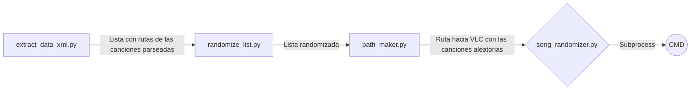
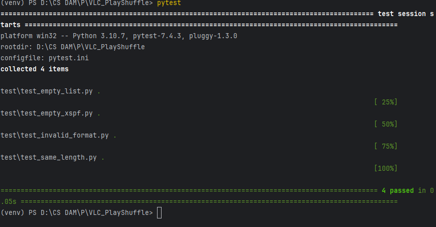
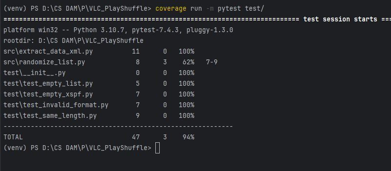

# VLC PlayShuffle


# Introducción

VLC PlayShuffle es un programa de **Python** creado únicamente para reproducir una lista de canciones aleatorias en un reproductor VLC como indica el título. 

Este proyecto está creado gracias a mi profesor de programación [David Gelpi](https://github.com/dfleta).

## Manual

Antes de comenzar, asegúrate de tener VLC instalado en tu sistema. Puedes descargar la última versión desde [el sitio oficial de VLC](https://www.videolan.org/vlc/index.html). **Muy importante instalarlo en el sitio predeterminado que te da Windows, macOS o Linux**. Además requerirás de [Git](https://git-scm.com/downloads) para clonar el proyecto en tu máquina.

Asegúrate de tener instalado [Python](https://www.python.org/) en una versión actualizada

A continuación crea un directorio en el lugar que quieras y sitúate dentro de el. Ya con esto hecho clona el repositorio de esta manera:
```
git clone https://github.com/Semperz/VLC_PlayShuffle.git
```

Métete en el directorio del proyecto:
```
cd VLC_PlayShuffle
```

Crea tu entorno virtual y actívalo:
```
$ python -m venv venv
$ .\venv\Scripts\activate
```

Asegúrate de tener instalado pip cuando instales Python con:
```
pip --version
```

Instala las dependencias que hay en el requirements.txt:
```
pip install -r requirements.txt
```

Y ejecuta el programa principal:
```
python song_randomizer.py
```

Nota:
Al ser un archivo hardcodeado, solo está disponible para la lista que yo creé de canciones. Pero aun así si queréis personalizarlo basta con quitar las canciones que yo puse en la carpeta **media**(y el xspf) e incluir las vuestras, además de con un archivo ".xspf" dentro de esa misma carpeta (en el propio VLC si incluyes canciones se puede exportar dicho archivo). El único requisito para que funcione en este caso es que el nombre de ese archivo de texto sea "playlist". 


## Metodología

Se han utilizado dos ramas principales: `main` para la versión estable y `develop` para el desarrollo continuo. En este caso como es un programa muy pequeño, la versión estable ahora mismo es la misma que la del desarrollo.

### Actividades en cada rama

-   `main`: Contiene el código estable y listo para su implementación.
-   `develop`: Incluye las características en desarrollo y se fusiona con `main` después de las pruebas.


## Descripción técnica

Esta aplicación como ya estaba antes comentado, funciona en base a un archivo ".xspf" hardcodeado. En la función principal `song randomizer.py` se toma la ruta de ese archivo (que se encuentra en la carpeta **media**) para que un módulo principal lo parsee y lo convierta en una lista (esta lista contiene la ruta absoluta de las canciones). Posteriormente otro módulo toma dicha lista y le da un orden aleatorio. El último módulo genera la ruta del VLC (dependiendo del sistema operativo) en una lista y se lo pasa a la función principal, para que junto a las dos anteriormente mencionadas, junten la ruta del VLC con la de las canciones en una lista y esta se ejecute. Esta ejecución va en base a un módulo integrado en la librería estándar de Python llamado `subprocess`, que de forma muy resumida en mi aplicación escribe en el CMD lo que le pases como argumento.


Los componentes que conforman la aplicación son:

- *Módulo principal* (song_randomizer.py): Toma la lista que le dan los otros módulos y la ejecuta en el CMD
- *Módulo de parseo* (extract_data_xml.py): Extrae la información necesaria del xspf y lo convierte en una lista
- *Módulo de orden aleatorio a la lista* (randomize_list.py): Randomiza la lista que viene del módulo anterior
- *Módulo generador de rutas* (path_maker.py): Añade la ruta del VLC dependiendo del sistema operativo que ejecute el programa.




*Este gráfico está creado gracias a una idea de mi compañero [Evan Silva](https://github.com/EvanSilva) y a la página de [Stackedit](https://stackedit.io/)*

## Casos test

Aquí adjunto una prueba con los casos test pasados 




## Coverage
 
 Además de los casos test, el reporte del **Coverage**




## Clockify

Aquí dejo un enlace al reporte del tiempo (estimado) que me llevó el proyecto y la descripción de cada uno de sus días con [Clockify](https://clockify.me/es/):

[Reporte del tiempo](Images/Clockify_report.pdf)

## Conclusiones

Este ha sido un proyecto que en principio no vi con mucha complicación pero con el paso del tiempo al hacerlo vi que me equivocaba completamente. Si es cierto que la parte de código no tiene nada extremadamente difícil pero se me empezaron a acumular fallos que en principio no debieron dar. El programa es muy completo y abarca prácticamente todo lo que aprendimos este primer trimestre pero aun así hay otras cosas que tuve que sacar por mi cuenta


### Posibles mejoras

Aun que el programa se ajusta a los criterios de uso y es un mínimo producto viable, me gustaría mejorarlo. La principal que veo es que el programa sea capaz de detectar donde se encuentra el VLC sin tener que depender de instalarlo en la ruta predeterminada de cada sistema operativo. Además otra sería que también encuentre las canciones y el archivo xspf sin tener que encontrarse en un directorio concreto. 

Como mejoras adicionales incluiría un controlador del VLC integrado en el CMD, que con ciertos comandos la canción se pare, le aumente el volumen o simplemente que cierre el reproductor.


### Dificultades 

En general las mayores dificultades de mi parte residieron en como estructurar los módulos y decidir cómo quería que se reprodujese dichas canciones, que finalmente decidí la más sencilla (usar un *string* y ejecutarlo en la consola).
Otra dificultad que encontré fue el hecho de los casos test. Al ser código simple no le veo muchas posibilidades de casos test además de comprobar que siempre se mantenga la lista y el archivo xspf no sea erróneo.
